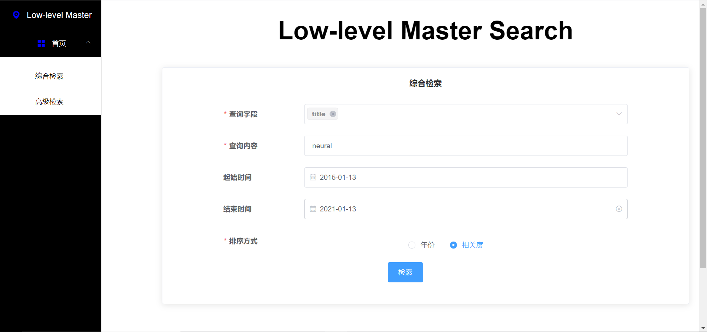
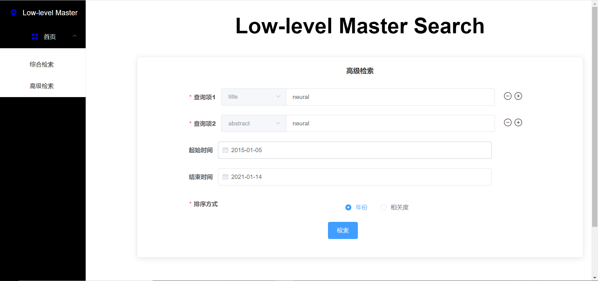
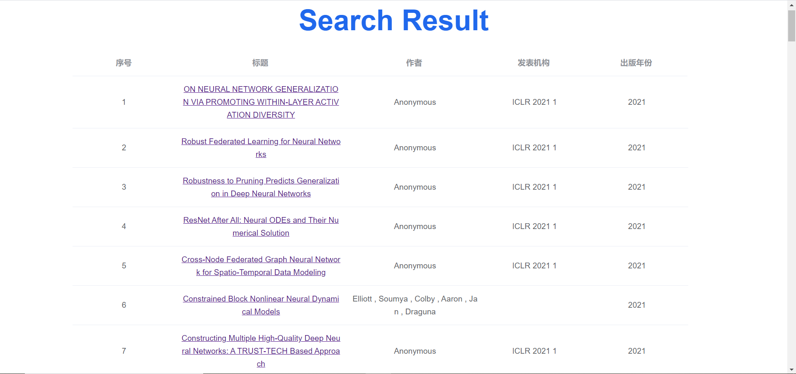
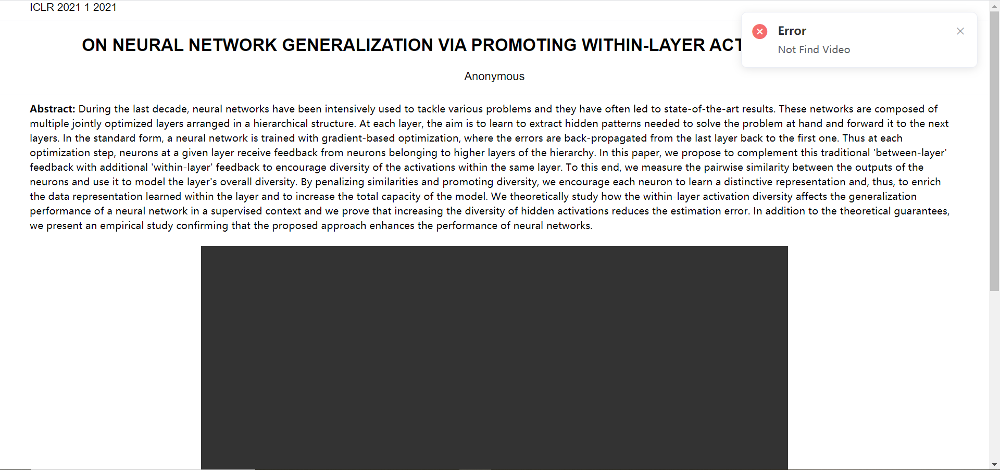

# Website-low-levelMasterDoWebShow

## 项目介绍

实现一个学术论文的搜索引擎网站前后端，包括首页（搜索页）、搜索结果列表页和论文详细信息页。

## 小组分工

|  姓名  |    学号    |                分工                 |
| :----: | :--------: | :---------------------------------: |
| 惠子杨 | 3120201028 |  负责前端整体框架的搭建、文档编写   |
| 蒋少杰 | 3120201033 | 负责铲除前端页面bug（都给他铲完了） |
|  李坤  | 3220201059 |      负责前后端交互逻辑的设计       |
| 邱思思 | 3220201079 | 负责综合检索以及高级检索页面的设计  |
| 田效宇 | 3220201086 |       负责后端整体逻辑的设计        |
| 王志鹏 | 3120201078 |     负责论文详细信息页面的设计      |

## 功能简述

- #### 检索页面

  - 综合检索页面：可选择title, abstract, paper_content等字段，并在此范围内对同一个query进行筛选匹配。可选择论文的起止年限（非必选），可选择根据年份或者相关度进行排序。
  - 高级检索页面：与综合检索页面不同之处在于可对每个检索字段选择一个query进行查询，其他部分相同。

- #### 文档列表页面

  根据综合检索或者高级检索页的请求返回相应的论文列表，可点击某一篇论文的title跳转到详细信息页面。

- #### 详细信息页面

  显示所选论文的详细信息，如title, abstract, video, pdf等。

## 项目部署

- 后端部分：使用检索模块提供的python包进行开发，

```
  pip install mdsearch -i https://pypi.org/simple
```

​	修改settings.py中的配置，

```
  ALLOWED_HOSTS = ['10.63.82.28'] //ip地址
```

​	之后在当前项目的命令行中输入以下命令即可启动服务。

```
  python manage.py runserver 10.63.82.28:9001 //ip:端口
```

- 前端部分：参考 [https://www.cnblogs.com/lgx5/p/10732016.html] 安装npm, vue框架，接着打开项目，运行以下命令安装相关依赖包。

```
  npm install
```

  可以在config/index.js中修改端口号，在命令行中输入以下命令便可启动项目。

```
  npm run dev
```

  

## 实现效果

- 综合检索页

  

- 高级检索页

  

- 检索列表页

  

- 详细信息页

  


